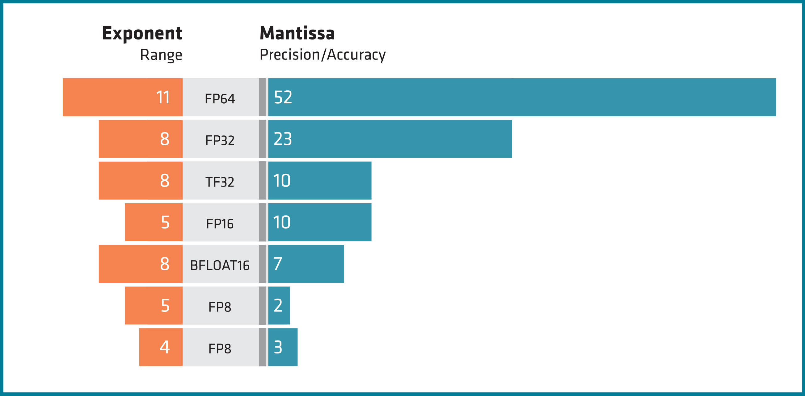

.. meta::
  :description: Supported data types in ROCm
  :keywords: int8, float8, float8 (E4M3), float8 (E5M2), bfloat8, float16, half, bfloat16, tensorfloat32, float, float32, float64, double, AMD, ROCm, AMDGPU

.. _rocm-supported-data-types:

*************************************************************
ROCm data type specifications
*************************************************************

Integral Types
==========================================

The signed and unsigned integral types that are supported by ROCm™ are listed in the following table, together with their corresponding HIP type and a short description.

.. list-table::
    :header-rows: 1
    :widths: 15,35,50

    * 
      - Type name
      - HIP type
      - Description
    * 
      - int8
      - ``int8_t``, ``uint8_t``
      - A signed or unsigned 8-bit integer.
    * 
      - int16
      - ``int16_t``, ``uint16_t``
      - A signed or unsigned 16-bit integer.
    * 
      - int32
      - ``int32_t``, ``uint32_t``
      - A signed or unsigned 32-bit integer.
    * 
      - int64
      - ``int64_t``, ``uint64_t``
      - A signed or unsigned 64-bit integer.
 
Floating-point Types
==========================================

The floating-point types that are supported by ROCm™ are listed in the following table, together with their corresponding HIP type and a short description.

.. list-table::
    :header-rows: 1
    :widths: 15,15,70

    * 
      - Type name
      - HIP type
      - Description
    *
      - float8 (E4M3)
      - ``-``
      - A 8-bit floating-point number mostly following IEEE-754 conventions and bit layout **S1E4M3** described in `8-bit Numerical Formats for Deep Neural Networks <https://arxiv.org/abs/2206.02915>`_ , with expanded range and with no infinity or signed zero. NaN is represented as negative zero.
    *
      - float8 (E5M2)
      - ``-``
      - A 8-bit floating-point number mostly following IEEE-754 conventions and bit layout **S1E5M2** described in `8-bit Numerical Formats for Deep Neural Networks <https://arxiv.org/abs/2206.02915>`_ , with expanded range and with no infinity or signed zero. NaN is represented as negative zero.
    *
      - float16
      - ``half``
      - A 16-bit floating-point number, conforming to the IEEE 754-2008 half precision storage format.
    *
      - bfloat16
      - ``bfloat16``
      - A shortened 16-bit version of the IEEE 754 single precision storage format.
    *
      - tensorfloat32
      - ``-``
      - Floating-point number that occupies 32 bits or less of storage, providing improved range compared to half (16-bit) format, at (potentially) greater throughput than single precision (32-bit) formats.
    *
      - float32
      - ``float``
      - A 32-bit floating-point number, conforming to the IEEE 754 single precision storage format.
    *
      - float64
      - ``double``
      - A 64-bit floating-point number, conforming to the IEEE 754 double precision storage format.

.. note::

  * The float8 and tensorfloat32 types are internal types used in calculations in the Matrix Cores and can be stored in any type of the same size.
  * The encodings for FP8 (E5M2) and FP8 (E4M3) natively supported by MI300 differ from the FP8 (E5M2) and FP8 (E4M3) encodings used in H100 (`FP8 formats for Deep Learning <https://arxiv.org/abs/2209.05433>`_ ).
  * In some AMD documents and articles float8 (E5M2) is called bfloat8.

The support icon description
==========================================

The ROCm™ data support icon explanation is listed in the following table. These
icons are used at the data type support pages of the libraries with the same meaning.

.. list-table::
    :header-rows: 1

    * 
      - The support icon explanation
      - Support icon
    * 
      - Not supported
      - ❌
    * 
      - Partial support
      - ⚠️
    * 
      - Full support
      - ✅

.. note::

  * Full support means, the type is supported natively or with hardware emulation.
  * Native support means, that the operations for that type are implemented in hardware. Types that are not natively supported, are emulated with the available hardware. The performance of non-natively supported types can differ from the full instruction throughput rate. For example, 16-bit integer operations can be performed on the 32-bit integer ALUs at full rate, however 64-bit integer operations might need several instructions on the 32-bit integer ALUs.
  * Any type can be emulated by software, but this page does not cover such cases.

Hardware type support
==========================================

The AMD GPUs support of data types of the different units listed in the 
following tables.

Compute units support
-------------------------------------------------------------------------------

The compute unit support of data types listed in the following table.

.. tab-set::

  .. tab-item:: Integral types
    :sync: integral-type

    .. list-table::
      :header-rows: 1

      * 
        - Type name
        - int8
        - int16
        - int32
        - int64
      * 
        - Mi100
        - ✅
        - ✅
        - ✅
        - ✅
      * 
        - Mi200 series
        - ✅
        - ✅
        - ✅
        - ✅
      * 
        - Mi300 series
        - ✅
        - ✅
        - ✅
        - ✅

  .. tab-item:: Floating-point types
    :sync: floating-point-type

    .. list-table::
      :header-rows: 1

      * 
        - Type name
        - float8 (E4M3)
        - float8 (E5M2)
        - float16  
        - bfloat16
        - tensorfloat32
        - float32
        - float64
      * 
        - Mi100
        - ❌
        - ❌
        - ✅
        - ✅
        - ❌
        - ✅
        - ✅
      * 
        - Mi200 series
        - ❌
        - ❌
        - ✅
        - ✅
        - ❌
        - ✅
        - ✅
      * 
        - Mi300 series
        - ❌
        - ❌
        - ✅
        - ✅
        - ❌
        - ✅
        - ✅

Matrix core support
-------------------------------------------------------------------------------

The following table lists which data types are supported on the matrix cores of different AMD GPUs.

.. tab-set::

  .. tab-item:: Integral types
    :sync: integral-type

    .. list-table::
      :header-rows: 1

      * 
        - Type name
        - int8
        - int16
        - int32
        - int64
      * 
        - Mi100
        - ✅
        - ❌
        - ❌
        - ❌
      * 
        - Mi200 series
        - ✅
        - ❌
        - ❌
        - ❌
      * 
        - Mi300 series
        - ✅
        - ❌
        - ❌
        - ❌

  .. tab-item:: Floating-point types
    :sync: floating-point-type

    .. list-table::
      :header-rows: 1

      * 
        - Type name
        - float8 (E4M3)
        - float8 (E5M2)
        - float16  
        - bfloat16
        - tensorfloat32
        - float32
        - float64
      * 
        - Mi100
        - ❌
        - ❌
        - ✅
        - ✅
        - ❌
        - ✅
        - ❌
      * 
        - Mi200 series
        - ❌
        - ❌
        - ✅
        - ✅
        - ❌
        - ✅
        - ✅
      * 
        - Mi300 series
        - ✅
        - ✅
        - ✅
        - ✅
        - ✅
        - ✅
        - ✅

Atomic operations support
-------------------------------------------------------------------------------

The atomic operations support of data types listed in the following table.

.. tab-set::

  .. tab-item:: Integral types
    :sync: integral-type

    .. list-table::
      :header-rows: 1

      * 
        - Type name
        - int8
        - int16
        - int32
        - int64
      * 
        - Mi100
        - ❌
        - ❌
        - ✅
        - ❌
      * 
        - Mi200 series
        - ❌
        - ❌
        - ✅
        - ✅
      * 
        - Mi300 series
        - ❌
        - ❌
        - ✅
        - ✅

  .. tab-item:: Floating-point types
    :sync: floating-point-type

    .. list-table::
      :header-rows: 1

      * 
        - Type name
        - float8 (E4M3)
        - float8 (E5M2)
        - float16  
        - bfloat16
        - tensorfloat32
        - float32
        - float64
      * 
        - Mi100
        - ❌
        - ❌
        - ✅
        - ❌
        - ❌
        - ✅
        - ❌
      * 
        - Mi200 series
        - ❌
        - ❌
        - ✅
        - ❌
        - ❌
        - ✅
        - ✅
      * 
        - Mi300 series
        - ❌
        - ❌
        - ✅
        - ❌
        - ❌
        - ✅
        - ✅

.. note::

  At natively not supported cases, the atomic operations can be emulated by
  software. Such software emulated atomic operations have high negative
  performance impact, when they frequently access the same memory address.

Data Type support in ROCm Libraries
==========================================

ROCm™ libraries support for int8, float8 (E4M3), float8 (E5M2), int16, float16,
bfloat16, int32, tensorfloat32, float32, int64 and float64 is listed in the
following tables.

Libraries input/output type support
-------------------------------------------------------------------------------

The ROCm™ libraries support of specific input and output data types is listed in 
the following tables. For a detailed description open the corresponding library data type
support page.

.. tab-set::

  .. tab-item:: Integral types
    :sync: integral-type

    .. list-table::
      :header-rows: 1

      * 
        - Library input/output data type name
        - int8
        - int16
        - int32
        - int64
      * 
        - hipSPARSELt (:doc:`details<hipsparselt:reference/data-type-support>`)
        - ✅/✅
        - ❌/❌
        - ❌/❌
        - ❌/❌
      * 
        - rocRAND (:doc:`details<rocrand:data-type-support>`) 
        - -/✅
        - -/✅
        - -/✅
        - -/✅
      * 
        - hipRAND (:doc:`details<hiprand:data-type-support>`) 
        - -/✅
        - -/✅ 
        - -/✅
        - -/✅
      * 
        - rocPRIM (:doc:`details<rocprim:data-type-support>`) 
        - ✅/✅
        - ✅/✅ 
        - ✅/✅
        - ✅/✅
      * 
        - hipCUB (:doc:`details<hipcub:data-type-support>`) 
        - ✅/✅
        - ✅/✅ 
        - ✅/✅
        - ✅/✅
      * 
        - rocThrust (:doc:`details<rocthrust:data-type-support>`)  
        - ✅/✅
        - ✅/✅ 
        - ✅/✅
        - ✅/✅

  .. tab-item:: Floating-point types
    :sync: floating-point-type

    .. list-table::
      :header-rows: 1

      * 
        - Library input/output data type name
        - float8 (E4M3)
        - float8 (E5M2)
        - float16  
        - bfloat16
        - tensorfloat32
        - float32
        - float64
      * 
        - hipSPARSELt (:doc:`details<hipsparselt:reference/data-type-support>`)
        - ❌/❌ 
        - ❌/❌
        - ✅/✅
        - ✅/✅
        - ❌/❌
        - ❌/❌
        - ❌/❌
      * 
        - rocRAND (:doc:`details<rocrand:data-type-support>`) 
        - -/❌
        - -/❌
        - -/✅
        - -/❌
        - -/❌
        - -/✅
        - -/✅
      * 
        - hipRAND (:doc:`details<hiprand:data-type-support>`) 
        - -/❌
        - -/❌
        - -/✅
        - -/❌
        - -/❌
        - -/✅
        - -/✅
      * 
        - rocPRIM (:doc:`details<rocprim:data-type-support>`) 
        - ❌/❌ 
        - ❌/❌
        - ✅/✅
        - ✅/✅
        - ❌/❌
        - ✅/✅
        - ✅/✅
      * 
        - hipCUB (:doc:`details<hipcub:data-type-support>`) 
        - ❌/❌ 
        - ❌/❌
        - ✅/✅
        - ✅/✅
        - ❌/❌
        - ✅/✅
        - ✅/✅
      * 
        - rocThrust (:doc:`details<rocthrust:data-type-support>`)  
        - ❌/❌ 
        - ❌/❌
        - ⚠️/⚠️
        - ⚠️/⚠️
        - ❌/❌
        - ✅/✅
        - ✅/✅

Libraries internal calculations type support
-------------------------------------------------------------------------------

The ROCm™ libraries support of specific internal data types is listed in the
following tables. For a detailed description open the corresponding library data type support
page.

.. tab-set::

  .. tab-item:: Integral types
    :sync: integral-type

    .. list-table::
      :header-rows: 1

      * 
        - Library internal data type name
        - int8
        - int16
        - int32
        - int64
      * 
        - hipSPARSELt (:doc:`details<hipsparselt:reference/data-type-support>`)
        - ❌
        - ❌
        - ✅
        - ❌

  .. tab-item:: Floating-point types
    :sync: floating-point-type

    .. list-table::
      :header-rows: 1

      * 
        - Library internal data type name
        - float8 (E4M3)
        - float8 (E5M2)
        - float16  
        - bfloat16
        - tensorfloat32
        - float32
        - float64
      * 
        - hipSPARSELt (:doc:`details<hipsparselt:reference/data-type-support>`)
        - ❌ 
        - ❌
        - ❌
        - ❌
        - ❌
        - ✅
        - ❌
