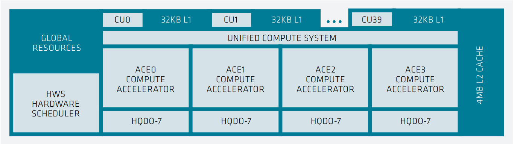

# AMD Instinct™ MI300 series microarchitecture

The microarchitecture of the AMD Instinct MI300 series accelerators is based on
the AMD CDNA 3 architecture that targets compute applications such as HPC,
artificial intelligence (AI), and machine learning (ML) and that run on
everything from individual servers to the world’s largest exascale
supercomputers. The overall system architecture is designed for extreme
scalability and compute performance.

At 300 series AMD introducing the Accelerator Complex Die (XCDs), which contain
the computational elements of the processor along with the lowest levels of the
cache hierarchy. The following image shows the components of an XCD of the
CDNA 3 architecture.



On the XCD, four Asynchronous Compute Engines (ACEs) send compute shader
workgroups to the Compute Units (CUs). The XCD has 40 CUs although at the
aggregate level there are only 38 active CUs, with 2 disabled for yield
management. The CUs all share a 4MB L2 cache that serves to coalesce all the
memory traffic for the die. The AMD CDNA™ 3 XCD die is a smaller building block
than the AMD Instinct MI200 Series compute die, with under half the CUs, but
using more advanced packaging, the processor includes 6-8 XCDs for as many as
304 CUs total, roughly 40% more than the MI250X.

The MI300 Series integrates up to 8 vertically stacked accelerator complex dies
(XCD) and 4 I/O dies (IOD) containing system infrastructure, all tied together
with the AMD Infinity Fabric™ technology and connecting to 8 stacks of
high-bandwidth memory 3 (HBM3).

The biggest improvements in the AMD CDNA 3 CUs are in the Matrix Cores and in
particular emphasizing AI and machine learning, by enhancing throughput for
existing data types and adding new data types supports. The AMD CDNA 2 Matrix
Cores supported FP16 and BF16, while offering INT8 for inference. The AMD CDNA 3
Matrix Cores triples performance for FP16 and BF16, while providing a 6.8x
performance gain for INT8 compared to previous Gen MI250X accelerators. FP8 and
TF32 data types support added to AMD CDNA 3 Matrix Cores with 16 times bigger
performance at FP8 case compared to FP32, while 4 times bigger performance at
TF32 case compared to FP32.

```{list-table} Peak-performance capabilities of the MI300X for different data types.
:header-rows: 1
:name: mi300x-perf-table

*
  - Computation and Data Type
  - FLOPS/CLOCK/CU
  - Peak TFLOPS
*
  - Matrix FP64
  - 256
  - 163.4
*
  - Vector FP64
  - 128
  - 81.7
*
  - Matrix FP32
  - 256
  - 163.4
*
  - Vector FP32
  - 256
  - 163.4
*
  - Vector TF32
  - 1024
  - 653.7
*
  - Matrix FP16
  - 2048
  - 1307.4
*
  - Matrix BF16
  - 2048
  - 1307.4
*
  - Matrix FP8
  - 4096
  - 2614.9
*
  - Matrix INT8
  - 4096
  - 2614.9
```

The above table summarizes the aggregated peak performance of the AMD Instinct
MI300X OCP Open Accelerator Modules (OAM, OCP is short for Open Compute
Platform) for different data types and execution units. The middle column lists
the peak performance (number of data elements processed in a single instruction)
of a single compute unit if a SIMD (or matrix) instruction is being retired in
each clock cycle. The third column lists the theoretical peak performance of the
OAM module. The theoretical aggregated peak memory bandwidth of the GPU is 5.3
TB/sec.


The image above shows the block diagram of the APU (on the left) and the OAM
package (on the right) that consists the XCDs which are are connected with AMD
Infinity Fabric™ network on-chip.

## Node-level architecture

The following image shows the node-level architecture of a system that is
based on the AMD Instinct MI300X accelerator.


The preceding image shows the node-level architecture of a system with AMD
EPYC processors in a dual-socket configuration and four AMD Instinct MI300
accelerators. The MI300 OAMs attach to the host system via PCIe Gen 5 x16 links
(yellow lines). The GPUs are using seven high-bandwidth and low-latency AMD
Infinity Fabric links (red lines) to form a fully connected 8-GPU system.

<!---
We need performance data about the P2P communication here.
-->
