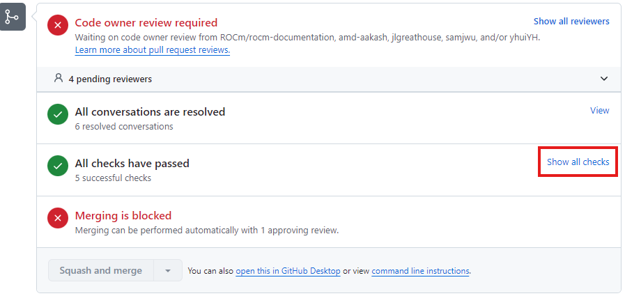
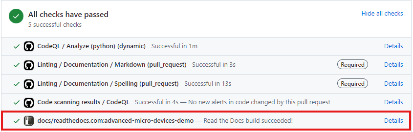

<head>
  <meta charset="UTF-8">
  <meta name="description" content="Contributing to ROCm">
  <meta name="keywords" content="ROCm, contributing, contribute, maintainer, contributor">
</head>

# Contributing to the ROCm documentation

The ROCm documentation, like all of ROCm, is open source and available on GitHub. You can contribute to the ROCm documentation by forking the appropriate repository, making your changes, and opening a pull request.

To provide feedback on the ROCm documentation, including submitting an issue or suggesting a feature, see [Providing feedback about the ROCm documentation](./feedback.md).

## The ROCm repositories

The repositories for ROCm and all ROCm components are available on GitHub.

| Module | Documentation location |
| --- | --- |
| ROCm framework | [https://github.com/ROCm/ROCm/tree/develop/docs](https://github.com/ROCm/ROCm/tree/develop/docs) |
| ROCm installation for Linux | [https://github.com/ROCm/rocm-install-on-linux/tree/develop/docs](https://github.com/ROCm/rocm-install-on-linux/tree/develop/docs) |
| ROCm HIP SDK installation for Windows |  [https://github.com/ROCm/rocm-install-on-windows/tree/develop/docs](https://github.com/ROCm/rocm-install-on-windows/tree/develop/docs) |

Individual components have their own repositories with their own documentation in their own `docs` folders.

The sub-folders within the `docs` folders across ROCm are typically structured as follows:

| Sub-folder name | Documentation type |
|-------|----------|
| `install` | Installation instructions, build instructions, and prerequisites |
| `conceptual` | Important concepts |
| `how-to` | How to implement specific use cases |
| `tutorials` | Tutorials |
| `reference` | API references and other reference resources |

## Editing and adding to the documentation

ROCm documentation follows the [Google developer documentation style guide](https://developers.google.com/style/highlights).

Most topics in the ROCm documentation are written in [reStructuredText (rst)](https://www.sphinx-doc.org/en/master/usage/restructuredtext/index.html), with some topics written in Markdown. Only use reStructuredText when adding new topics. Only use Markdown if the topic you are editing is already in Markdown.

To edit or add to the documentation:

1. Fork the repository you want to add to or edit.
2. Clone your fork locally.
3. Create a new local branch cut from the `develop` branch of the repository.
4. Make your changes to the documentation.

5. Optionally, build the documentation locally before creating a pull request by running the following commands from within the `docs` folder:

    ```bash
     pip3 install -r sphinx/requirements.txt  # You only need to run this command once
     python3 -m sphinx -T -E -b html -d _build/doctrees -D language=en . _build/html
     ```

    The output files will be located in the `docs/_build` folder. Open `docs/_build/html/index.html` to view the documentation.

    For more information on ROCm build tools, see [Documentation toolchain](toolchain.md).
6. Push your changes. A GitHub link will be returned in the output of the `git push` command. Open this link in a browser to create the pull request.

    The documentation is built as part of the checks on pull request, along with spell checking and linting. Scroll to the bottom of your pull request to view all the checks.

    Verify that the linting and spell checking have passed, and that the documentation was built successfully. New words or acronyms can be added to the [wordlist file](https://github.com/ROCm/rocm-docs-core/blob/develop/.wordlist.txt). The wordlist is subject to approval by the ROCm documentation team.

    The Read The Docs build of your pull request can be accessed by clicking on the Details link next to the Read The Docs build check. Verify that your changes are in the build and look as expected.

    
  
    

    Your pull request will be reviewed by a member of the ROCm documentation team.

See the [GitHub documentation](https://docs.github.com/en) for information on how to fork and clone a repository, and how to create and push a local branch.

```{important}
By creating a pull request (PR), you agree to allow your contribution to be licensed under the terms of the
LICENSE.txt file in the corresponding repository. Different repositories can use different licenses.
```
