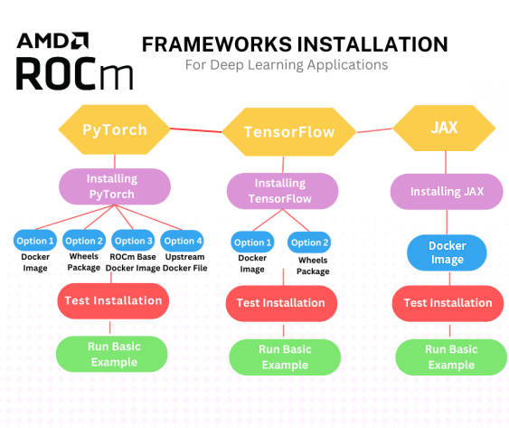

.. meta::
   :description: How to install deep learning frameworks for ROCm
   :keywords: deep learning, frameworks, ROCm, install, PyTorch, TensorFlow, JAX, MAGMA, DeepSpeed, ML, AI

********************************************
Installing deep learning frameworks for ROCm
********************************************

ROCm provides a comprehensive ecosystem for deep learning development, including :doc:`libraries
<reference/api-libraries>` for optimized deep learning operations and ROCm-aware versions of popular deep learning
frameworks such as PyTorch and TensorFlow.

ROCm works closely with popular deep learning frameworks like PyTorch, TensorFlow, JAX, and MAGMA to ensure seamless
integration. This includes providing accelerated backends and ensuring that framework-specific optimizations take
advantage of AMD accelerator and GPU architectures.

The following guides cover installation processes for ROCm-aware deep learning frameworks.

* :doc:`PyTorch for ROCm <rocm-install-on-linux:how-to/3rd-party/pytorch-install>`

* :doc:`TensorFlow for ROCm <rocm-install-on-linux:how-to/3rd-party/tensorflow-install>`

* :doc:`JAX for ROCm <rocm-install-on-linux:how-to/3rd-party/jax-install>`

* :doc:`MAGMA for ROCm<rocm-install-on-linux:how-to/3rd-party/magma-install>`

The following flowchart steps through a typical installation of a deep learning framework for ROCm.

Find information on version compatibility and framework release notes in :doc:`Third-party support matrix
<rocm-install-on-linux:reference/3rd-party-support-matrix>`.

For guidance on installing ROCm itself, refer to :doc:`ROCm installation for Linux <rocm-install-on-linux:index>`.

.. Learn how to take advantage of your ROCm-aware deep learning environment using the following tutorials.
..
..    * :doc:`How to use ROCm for AI <how-to/rocm-for-ai/index>`
..
..    * :doc:`How to fine-tune LLMs with ROCm <how-to/fine-tuning-llms/index>`
..

