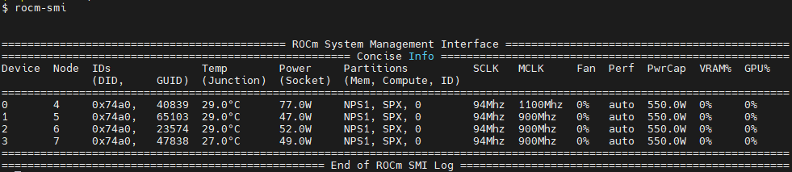
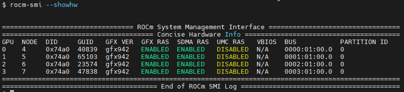
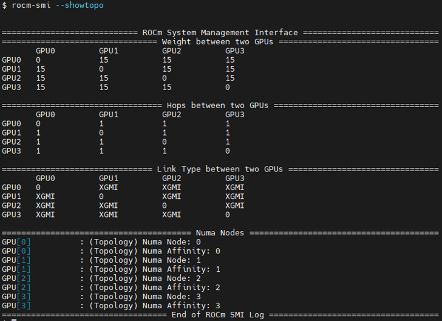
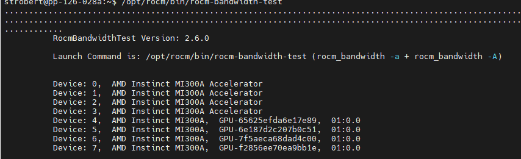
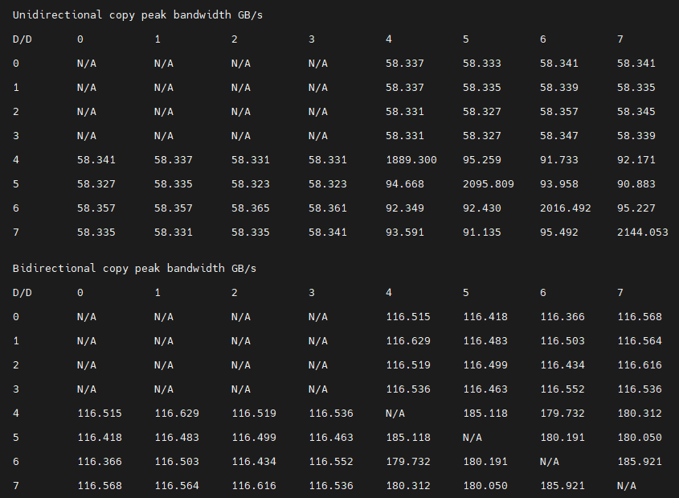

.. meta::
   :description: AMD Instinct MI300A system settings
   :keywords: AMD, Instinct, MI300A, HPC, tuning, BIOS settings, NBIO, ROCm,
              environment variable, performance, accelerator, GPU, EPYC, GRUB,
              operating system

***************************************************
AMD Instinct MI300A system optimization
***************************************************

This topic discusses the operating system settings and system management commands for 
the AMD Instinct MI300A accelerator. This topic can help you optimize performance.

System settings
========================================

This section reviews the system settings required to configure a MI300A SOC system and
optimize its performance.

The MI300A system-on-a-chip (SOC) design requires you to review and potentially adjust your OS configuration as explained in 
the :ref:`operating-system-settings-label` section. These settings are critical for 
performance because the OS on an accelerated processing unit (APU) is responsible for memory management across the CPU and GPU accelerators.
In the APU memory model, system settings are available to limit GPU memory allocation. 
This limit is important because legacy software often determines the 
amount of allowable memory at start-up time
by probing discrete memory until it is exhausted. If left unchecked, this practice 
can starve the OS of resources. 

System BIOS settings
-----------------------------------

System BIOS settings are preconfigured for optimal performance from the 
platform vendor. This means that you do not need to adjust these settings 
when using MI300A. If you have any questions regarding these settings, 
contact your MI300A platform vendor.

GRUB settings 
-----------------------------------

The ``/etc/default/grub`` file is used to configure the GRUB bootloader on modern Linux distributions. 
Linux uses the string assigned to ``GRUB_CMDLINE_LINUX`` in this file as
its command line parameters during boot.

Appending strings using the Linux command line
^^^^^^^^^^^^^^^^^^^^^^^^^^^^^^^^^^^^^^^^^^^^^^^

It is recommended that you append the following string to ``GRUB_CMDLINE_LINUX``.

``pci=realloc=off``
  This setting disables the automatic reallocation
  of PCI resources, so Linux is able to unambiguously detect all GPUs on the
  MI300A-based system. It's used when Single Root I/O Virtualization (SR-IOV) Base
  Address Registers (BARs) have not been allocated by the BIOS. This can help
  avoid potential issues with certain hardware configurations.

Validating the IOMMU setting
^^^^^^^^^^^^^^^^^^^^^^^^^^^^^^^^^^^^^^^^^^^^^^^

IOMMU is a system-specific IO mapping mechanism for DMA mapping
and isolation. IOMMU is turned off by default in the operating system settings 
for optimal performance.

To verify IOMMU is turned off, first install the ``acpica-tools`` package using your 
package manager.

.. code-block:: shell

   sudo apt install acpica-tools

Then confirm that the following commands do not return any results.

.. code-block:: shell

   sudo acpidump | grep IVRS
   sudo acpidump | grep DMAR

Update GRUB
^^^^^^^^^^^^^^^^^^^^^^^^^^^^^^^^^^^^^^^^^^^^^^^

Use this command to update GRUB to use the modified configuration:

.. code-block:: shell

   sudo grub2-mkconfig -o /boot/grub2/grub.cfg

On some Red Hat-based systems, the ``grub2-mkconfig`` command might not be available. In this case,
use ``grub-mkconfig`` instead. Verify that you have the
correct version by using the following command:

.. code-block:: shell

   grub-mkconfig -version

.. _operating-system-settings-label:

Operating system settings 
-----------------------------------

The operating system provides several options to customize and tune performance. For more information 
about supported operating systems, see the :doc:`Compatibility matrix <../../compatibility/compatibility-matrix>`. 
 
If you are using a distribution other than RHEL or SLES, the latest Linux kernel is recommended.
Performance considerations for the Zen4, which is the core architecture in the MI300A, 
require a Linux kernel running version 5.18 or higher. 

This section describes performance-based settings.

* **Enable transparent huge pages** 

  To enable transparent huge pages, use one of the following methods:

  * From the command line, run the following command:
  
    .. code-block:: shell

       echo always > /sys/kernel/mm/transparent_hugepage/enabled  

  * Set the Linux kernel parameter ``transparent_hugepage`` as follows in the 
    relevant ``.cfg`` file for your system.

    .. code-block:: cfg

       transparent_hugepage=always

* **Increase the amount of allocatable memory**

  By default, when using a device allocator via HIP, it is only possible to allocate 96 GiB out of 
  a possible 128 GiB of memory on the MI300A. This limitation does not affect host allocations.
  To increase the available system memory, load the ``amdttm`` module with new values for
  ``pages_limit`` and ``page_pool_size``. These numbers correspond to the number of 4 KiB pages of memory.
  To make 128 GiB of memory available across all four devices, for a total amount of 512 GiB,
  set ``pages_limit`` and ``page_pool_size`` to ``134217728``. For a two-socket system, divide these values
  by two. After setting these values, reload the AMDGPU driver.

  First, review the current settings using this shell command:

  .. code-block:: shell

     cat /sys/module/amdttm/parameters/pages_limit 
  
  To set the amount of allocatable memory to all available memory on all four APU devices, run these commands:

  .. code-block:: shell

     sudo modprobe amdttm pages_limit=134217728 page_pool_size=134217728
     sudo modprobe amdgpu

  These settings can also be hardcoded in the ``/etc/modprobe.d/amdttm.conf`` file or specified as boot
  parameters.
  
  To use the hardcoded method, 
  the filesystem must already be set up when the kernel driver is loaded.
  To hardcode the settings, add the following lines to ``/etc/modprobe.d/amdttm.conf``:

  .. code-block:: shell

     options amdttm pages_limit=134217728
     options amdttm page_pool_size=134217728

  If the filesystem is not already set up when the kernel driver is loaded, then the options
  must be specified as boot parameters. To specify the settings
  as boot parameters when loading the kernel, use this example as a guideline:

  .. code-block:: shell

     vmlinux-[...] amdttm.pages_limit=134217728 amdttm.page_pool_size=134217728 [...]

  To verify the new settings and confirm the change, use this command:

  .. code-block:: shell

     cat /sys/module/amdttm/parameters/pages_limit 

  .. note::

     The system settings for ``pages_limit`` and ``page_pool_size`` are calculated by multiplying the
     per-APU limit of 4 KiB pages, which is ``33554432``, by the number of APUs on the node. The limit for a system with
     two APUs ``33554432 x 2`` or ``67108864``.
     This means the ``modprobe`` command for two APUs is ``sudo modprobe amdttm pages_limit=67108864 page_pool_size=67108864``.

* **Limit the maximum and single memory allocations on the GPU**
  
  Many AI-related applications were originally developed on discrete GPUs. Some of these applications 
  have fixed problem sizes associated with the targeted GPU size, and some attempt to determine the 
  system memory limits by allocating chunks until failure. These techniques can cause issues in an 
  APU with a shared space.
  
  To allow these applications to run on the APU without further changes, 
  ROCm supports a default memory policy that restricts the percentage of the GPU that can be allocated. 
  The following environment variables control this feature: 

  * ``GPU_MAX_ALLOC_PERCENT``
  * ``GPU_SINGLE_ALLOC_PERCENT``

  These settings can be added to the default shell environment or the user environment. The effect of the memory allocation 
  settings varies depending on the system, configuration, and task. They might require adjustment, especially when performing GPU benchmarks. Setting these values to ``100`` 
  lets the GPU allocate any amount of free memory. However, the risk of encountering 
  an operating system out-of-memory (OMM) condition increases when almost 
  all the available memory is used.
  
  Before setting either of these items to 100 percent, 
  carefully consider the expected CPU workload allocation and the anticipated OS usage. 
  For instance, if the OS requires 8GB on a 128GB system, setting these 
  variables to ``100`` authorizes a single 
  workload to allocate up to 120GB of memory. Unless the system has swap space configured 
  any over-allocation attempts will be handled by the OMM policies.

* **Disable NUMA (Non-uniform memory access) balancing**
  
  ROCm uses information from the compiled application to ensure an affinity exists
  between the GPU agent processes and their CPU hosts or co-processing agents. 
  Because the APU has OS threads, 
  including threads with memory management, the default kernel NUMA policies can
  adversely impact workload performance without additional tuning.

  .. note::

     At the kernel level, ``pci_relloc`` can also be set to ``off`` as an additional tuning measure. 

  To disable NUMA balancing, use one of the following methods:

  * From the command line, run the following command:
  
    .. code-block:: shell

       echo 0 > /proc/sys/kernel/numa_balancing   

  * Set the following Linux kernel parameters in the 
    relevant ``.cfg`` file for your system.

    .. code-block:: cfg

       pci=realloc=off numa_balancing=disable  

* **Enable compaction**

  Compaction is necessary for proper MI300A operation because the APU dynamically shares memory 
  between the CPU and GPU. Compaction can be done proactively, which reduces 
  allocation costs, or performed during allocation, in which case it is part of the background activities. 
  Without compaction, the MI300A application performance eventually degrades as fragmentation increases. 
  In RHEL distributions, compaction is disabled by default. In Ubuntu, it's enabled by default. 

  To enable compaction, enter the following commands using the command line:
  
  .. code-block:: shell

     echo 20 > /proc/sys/vm/compaction_proactiveness 
     echo 1 > /proc/sys/vm/compact_unevictable_allowed  

.. _mi300a-processor-affinity:

* **Change affinity of ROCm helper threads**
  
  Changing the affinity prevents internal ROCm threads from having their CPU core affinity mask 
  set to all CPU cores available. With this setting, the threads inherit their parent's 
  CPU core affinity mask. Before adjusting this setting, ensure you thoroughly understand 
  your system topology and how the application, runtime environment, and batch system
  set the thread-to-core affinity. If you have any questions regarding this setting, 
  contact your MI300A platform vendor or the AMD support team. 
  To enable this setting, enter the following command:

  .. code-block:: shell

     export HSA_OVERRIDE_CPU_AFFINITY_DEBUG=0 

* **CPU core states and C-states**

  The system BIOS handles these settings for the MI300A. 
  They don't need to be configured on the operating system.

System management
========================================

For a complete guide on installing, managing, and uninstalling ROCm on Linux, see
:doc:`Quick-start (Linux)<rocm-install-on-linux:install/quick-start>`. To verify that the
installation was successful, see the
:doc:`Post-installation instructions<rocm-install-on-linux:install/post-install>` and 
:doc:`ROCm tools <../../reference/rocm-tools>` guides. If verification
fails, consult the :doc:`System debugging guide <../system-debugging>`.

.. _hw-verification-rocm-label:

Hardware verification with ROCm 
-----------------------------------

ROCm includes tools to query the system structure. To query
the GPU hardware, use the ``rocm-smi`` command.

``rocm-smi`` reports statistics per socket, so the power results combine CPU and GPU utilization. 
In an idle state on a multi-socket system, some power imbalances are expected because 
the distribution of OS threads can keep some APU devices at higher power states.

.. note::

   The MI300A VRAM settings show as ``N/A``. 

The ``rocm-smi --showhw`` command shows the available system
GPUs and their device ID and firmware details.

In the MI300A hardware settings, the system BIOS handles the UMC RAS. The 
ROCm-supplied GPU driver does not manage this setting.
This results in a value of ``DISABLED`` for the ``UMC RAS`` setting. 

To see the system structure, the localization of the GPUs in the system, and the 
fabric connections between the system components, use the ``rocm-smi --showtopo`` command.

* The first block of the output shows the distance between the GPUs. The weight is a qualitative 
  measure of the “distance” data must travel to reach one GPU from another. 
  While the values do not have a precise physical meaning, the higher the value the 
  more hops are required to reach the destination from the source GPU.
* The second block contains a matrix named “Hops between two GPUs”, where ``1`` means 
  the two GPUs are directly connected with XGMI, ``2`` means both GPUs are linked to the 
  same CPU socket and GPU communications go through the CPU, and ``3`` means 
  both GPUs are linked to different CPU sockets so communications go 
  through both CPU sockets.
* The third block indicates the link types between the GPUs. This can either be 
  ``XGMI`` for AMD Infinity Fabric links or ``PCIE`` for PCIe Gen4 links.
* The fourth block reveals the localization of a GPU with respect to the NUMA organization 
  of the shared memory of the AMD EPYC processors.

Testing inter-device bandwidth
-----------------------------------

The ``rocm-smi --showtopo`` command from the :ref:`hw-verification-rocm-label` section 
displays the system structure and shows how the GPUs are located and connected within this
structure. For more information, use the :doc:`ROCm Bandwidth Test <rocm_bandwidth_test:index>`, which can run benchmarks to
show the effective link bandwidth between the system components.

For information on how to install the ROCm Bandwidth Test, see :doc:`Building the environment <rocm_bandwidth_test:install/install>`.

The output lists the available compute devices (CPUs and GPUs), including
their device ID and PCIe ID:

It also displays the measured bandwidth for unidirectional and
bidirectional transfers between the devices on the CPU and GPU:

Abbreviations
=============

APBDIS
  Algorithmic Performance Boost Disable

APU
  Accelerated processing unit

BAR
  Base Address Register

BIOS
  Basic Input/Output System

CBS
  Common BIOS Settings

CCD
  Compute Core Die

CDNA
  Compute DNA

CLI
  Command Line Interface

CPU
  Central Processing Unit

cTDP
  Configurable Thermal Design Power

DF
  Data Fabric

DMA
  Direct Memory Access

GPU
  Graphics Processing Unit

GRUB
  Grand Unified Bootloader

HBM
  High Bandwidth Memory

HPC
  High Performance Computing

IOMMU
  Input-Output Memory Management Unit

ISA
  Instruction Set Architecture

NBIO
  North Bridge Input/Output

NUMA
  Non-Uniform Memory Access

OMM
  Out of Memory

PCI
  Peripheral Component Interconnect

PCIe
  PCI Express

POR
  Power-On Reset

RAS
  Reliability, availability and serviceability

SMI
  System Management Interface

SMT
  Simultaneous Multi-threading

SOC
  System On Chip

SR-IOV
  Single Root I/O Virtualization

TSME
  Transparent Secure Memory Encryption

UMC
  Unified Memory Controller

VRAM
  Video RAM

xGMI
  Inter-chip Global Memory Interconnect 
