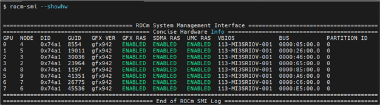
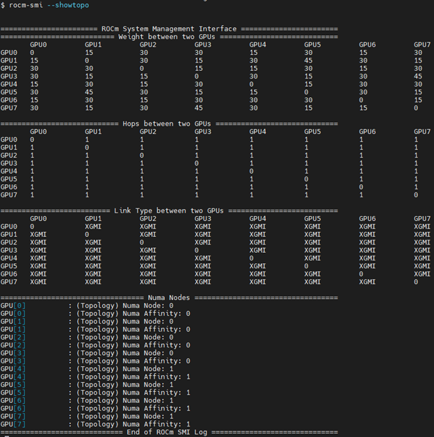
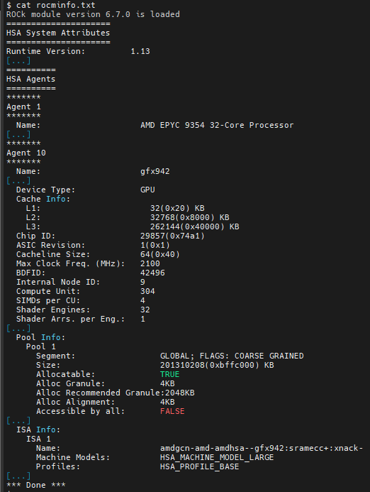
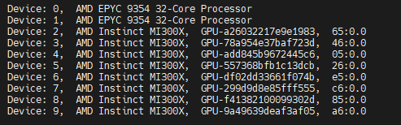
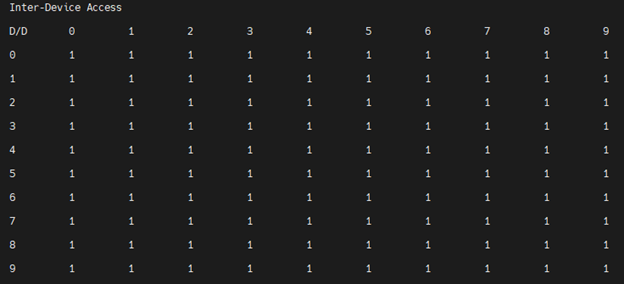
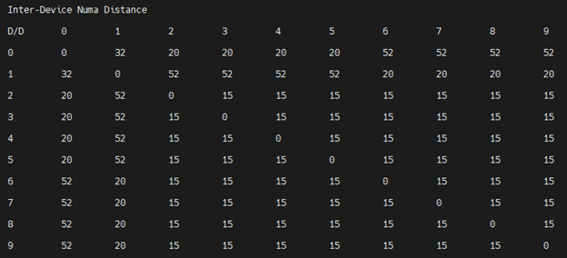
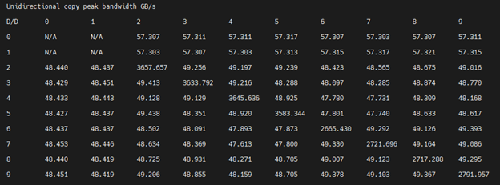
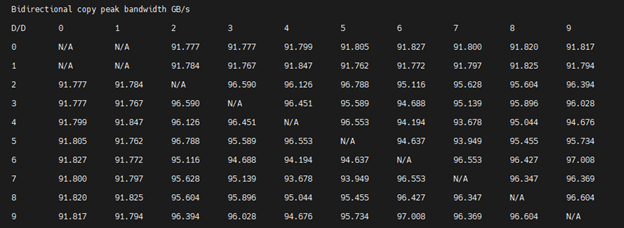

.. meta::
   :description: AMD Instinct MI300X system settings
   :keywords: AMD, Instinct, MI300X, HPC, tuning, BIOS settings, NBIO, ROCm,
              environment variable, performance, accelerator, GPU, EPYC, GRUB,
              operating system

***************************************
AMD Instinct MI300X system optimization
***************************************

This document covers essential system settings and management practices required
to configure your system effectively. Ensuring that your system operates
correctly is the first step before delving into advanced performance tuning.

The main topics of discussion in this document are:

* :ref:`System settings <mi300x-system-settings>`

  * :ref:`System BIOS settings <mi300x-bios-settings>`

  * :ref:`GRUB settings <mi300x-grub-settings>`

  * :ref:`Operating system settings <mi300x-os-settings>`

* :ref:`System management <mi300x-system-management>`

.. _mi300x-system-settings:

System settings
===============

This guide discusses system settings that are required to configure your system
for AMD Instinct™ MI300X accelerators. It is important to ensure a system is
functioning correctly before trying to improve its overall performance. In this
section, the settings discussed mostly ensure proper functionality of your
Instinct-based system. Some settings discussed are known to improve performance
for most applications running on a MI300X system. See
:doc:`/how-to/tuning-guides/mi300x/workload` for how to improve performance for
specific applications or workloads.

.. _mi300x-bios-settings:

System BIOS settings
--------------------

AMD EPYC 9004-based systems
^^^^^^^^^^^^^^^^^^^^^^^^^^^

For maximum MI300X GPU performance on systems with AMD EPYC™ 9004-series
processors and AMI System BIOS, the following configuration
of system BIOS settings has been validated. These settings must be used for the
qualification process and should be set as default values in the system BIOS.
Analogous settings for other non-AMI System BIOS providers could be set
similarly. For systems with Intel processors, some settings may not apply or be
available as listed in the following table.

Each row in the table details a setting but the specific location within the
BIOS setup menus may be different, or the option may not be present. 

.. list-table::
   :header-rows: 1

   * - BIOS setting location

     - Parameter

     - Value

     - Comments

   * - Advanced / PCI subsystem settings

     - Above 4G decoding

     - Enabled

     - GPU large BAR support.

   * - Advanced / PCI subsystem settings

     - SR-IOV support

     - Enabled

     - Enable single root IO virtualization.

   * - AMD CBS / GPU common options

     - Global C-state control

     - Auto

     - Global C-states -- do not disable this menu item).

   * - AMD CBS / GPU common options

     - CCD/Core/Thread enablement

     - Accept

     - May be necessary to enable the SMT control menu.

   * - AMD CBS / GPU common options / performance

     - SMT control

     - Disable

     - Set to Auto if the primary application is not compute-bound.

   * - AMD CBS / DF common options / memory addressing

     - NUMA nodes per socket

     - Auto

     - Auto = NPS1. At this time, the other options for NUMA nodes per socket
       should not be used.

   * - AMD CBS / DF common options / memory addressing

     - Memory interleaving

     - Auto

     - Depends on NUMA nodes (NPS) setting.

   * - AMD CBS / DF common options / link

     - 4-link xGMI max speed

     - 32 Gbps

     - Auto results in the speed being set to the lower of the max speed the
       motherboard is designed to support and the max speed of the CPU in use.

   * - AMD CBS / NBIO common options

     - IOMMU

     - Enabled

     - 

   * - AMD CBS / NBIO common options

     - PCIe ten bit tag support

     - Auto

     - 

   * - AMD CBS / NBIO common options / SMU common options

     - Determinism control

     - Manual

     - 

   * - AMD CBS / NBIO common options / SMU common options

     - Determinism slider

     - Power

     - 

   * - AMD CBS / NBIO common options / SMU common options

     - cTDP control

     - Manual

     - Set cTDP to the maximum supported by the installed CPU.

   * - AMD CBS / NBIO common options / SMU common options

     - cTDP

     - 400

     - Value in watts.

   * - AMD CBS / NBIO common options / SMU common options

     - Package power limit control

     - Manual

     - Set package power limit to the maximum supported by the installed CPU.

   * - AMD CBS / NBIO common options / SMU common options

     - Package power limit

     - 400

     - Value in watts.

   * - AMD CBS / NBIO common options / SMU common options

     - xGMI link width control

     - Manual

     - Set package power limit to the maximum supported by the installed CPU.

   * - AMD CBS / NBIO common options / SMU common options

     - xGMI force width control

     - Force

     - 

   * - AMD CBS / NBIO common options / SMU common options

     - xGMI force link width

     - 2

     - * 0: Force xGMI link width to x2
       * 1: Force xGMI link width to x8
       * 2: Force xGMI link width to x16

   * - AMD CBS / NBIO common options / SMU common options

     - xGMI max speed

     - Auto

     - Auto results in the speed being set to the lower of the max speed the
       motherboard is designed to support and the max speed of the CPU in use.

   * - AMD CBS / NBIO common options / SMU common options

     - APBDIS

     - 1

     - Disable DF (data fabric) P-states

   * - AMD CBS / NBIO common options / SMU common options

     - DF C-states

     - Auto

     - 

   * - AMD CBS / NBIO common options / SMU common options

     - Fixed SOC P-state

     - P0

     - 

   * - AMD CBS / security

     - TSME

     - Disabled

     - Memory encryption

.. _mi300x-grub-settings:

GRUB settings
-------------

In any modern Linux distribution, the ``/etc/default/grub`` file is used to
configure GRUB. In this file, the string assigned to ``GRUB_CMDLINE_LINUX`` is
the command line parameters that Linux uses during boot.

Appending strings via Linux command line
^^^^^^^^^^^^^^^^^^^^^^^^^^^^^^^^^^^^^^^^

It is recommended to append the following strings in ``GRUB_CMDLINE_LINUX``.

``pci=realloc=off``
  With this setting Linux is able to unambiguously detect all GPUs of the
  MI300X-based system because this setting disables the automatic reallocation
  of PCI resources. It's used when Single Root I/O Virtualization (SR-IOV) Base
  Address Registers (BARs) have not been allocated by the BIOS. This can help
  avoid potential issues with certain hardware configurations.

``iommu=pt``
  The ``iommu=pt`` setting enables IOMMU pass-through mode. When in pass-through
  mode, the adapter does not need to use DMA translation to the memory, which can
  improve performance.

IOMMU is a system specific IO mapping mechanism and can be used for DMA mapping
and isolation. This can be beneficial for virtualization and device assignment
to virtual machines. It is recommended to enable IOMMU support.

For a system that has AMD host CPUs add this to ``GRUB_CMDLINE_LINUX``:

.. code-block:: text

   iommu=pt

Otherwise, if the system has Intel host CPUs add this instead to
``GRUB_CMDLINE_LINUX``:

.. code-block:: text

   intel_iommu=on iommu=pt

Update GRUB
-----------

Update GRUB to use the modified configuration:

.. code-block:: shell

   sudo grub2-mkconfig -o /boot/grub2/grub.cfg

On some Debian systems, the ``grub2-mkconfig`` command may not be available. Instead,
check for the presence of ``grub-mkconfig``. Additionally, verify that you have the
correct version by using the following command:

.. code-block:: shell

   grub-mkconfig -version

.. _mi300x-os-settings:

Operating system settings
-------------------------

CPU core states (C-states)
^^^^^^^^^^^^^^^^^^^^^^^^^^

There are several core states (C-states) that an AMD EPYC CPU can idle within:

* **C0**: active. This is the active state while running an application.

* **C1**: idle. This state consumes less power compared to C0, but can quickly
  return to the active state (C0) with minimal latency.

* **C2**: idle and power-gated. This is a deeper sleep state and will have greater
  latency when moving back to the active (C0) state as compared to when the CPU
  is coming out of C1.

Disabling C2 is important for running with a high performance, low-latency
network. To disable the C2 state, install the ``cpupower`` tool using your Linux
distribution's package manager. ``cpupower`` is not a base package in most Linux
distributions. The specific package to be installed varies per Linux
distribution.

.. tab-set::

   .. tab-item:: Ubuntu
      :sync: ubuntu

      .. code-block:: shell

         sudo apt install linux-tools-common

   .. tab-item:: RHEL
      :sync: rhel

      .. code-block:: shell

         sudo yum install cpupowerutils

   .. tab-item:: SLES
      :sync: sles

      .. code-block:: shell

         sudo zypper install cpupower

Now, to disable power-gating on all cores run the following on Linux
systems, run the following command.

.. code-block:: shell

   cpupower idle-set -d 2

`/proc` and `/sys` file system settings
^^^^^^^^^^^^^^^^^^^^^^^^^^^^^^^^^^^^^^^

.. _mi300x-disable-numa:

Disable NUMA auto-balancing
'''''''''''''''''''''''''''

The NUMA balancing feature allows the OS to scan memory and attempt to migrate
to a DIMM that is logically closer to the cores accessing it. This causes an
overhead because the OS is second-guessing your NUMA allocations but may be
useful if the NUMA locality access is very poor. Applications can therefore, in
general, benefit from disabling NUMA balancing; however, there are workloads where
doing so is detrimental to performance. Test this setting
by toggling the ``numa_balancing`` value and running the application; compare
the performance of one run with this set to ``0`` and another run with this to
``1``.

Run the command ``cat /proc/sys/kernel/numa_balancing`` to check the current
NUMA (Non-Uniform Memory Access) settings. Output ``0`` indicates this
setting is disabled. If no output or output is ``1``, run the command
``sudo sh -c \\'echo 0 > /proc/sys/kernel/numa_balancing`` to disable it.

For these settings, the ``env_check.sh`` script automates setting, resetting,
and checking your environments. Find the script at
`<https://github.com/ROCm/triton/blob/rocm_env/scripts/amd/env_check.sh>`__.

Run the script as follows to set or reset the settings:

``./env_check.sh [set/reset/check]``

.. tip::

   Use ``./env_check.sh -h`` for help info.

Automate disabling NUMA auto-balance using Cron
~~~~~~~~~~~~~~~~~~~~~~~~~~~~~~~~~~~~~~~~~~~~~~~

The :ref:`mi300x-disable-numa` section describes the command to disable NUMA
auto-balance. To automate the command with Cron, edit the ``crontab``
configuration file for the root user:

.. code-block:: shell

   sudo crontab -e

#. Add the following Cron entry to run the script at a specific interval:

   .. code-block:: shell

      @reboot sh -c 'echo 0 > /proc/sys/kernel/numa_balancing'

#. Save the file and exit the text editor.

#. Optionally, restart the system to apply changes by issuing ``sudo reboot``.

#. Verify your new configuration.

   .. code-block::

      cat /proc/sys/kernel/numa_balancing

   The ``/proc/sys/kernel/numa_balancing`` file controls NUMA balancing in the
   Linux kernel. If the value in this file is set to ``0``, the NUMA balancing
   is disabled. If the value is set to ``1``, NUMA balancing is enabled.

.. note::

   Disabling NUMA balancing should be done cautiously and for
   specific reasons, such as performance optimization or addressing
   particular issues. Always test the impact of disabling NUMA balancing in
   a controlled environment before applying changes to a production system.

.. _mi300x-env-vars:

Environment variables
^^^^^^^^^^^^^^^^^^^^^

HIP provides an environment variable export ``HIP_FORCE_DEV_KERNARG=1`` that
can put arguments of HIP kernels directly to device memory to reduce the
latency of accessing those kernel arguments. It can improve performance by 2 to
3 µs for some kernels.

It is recommended to set the following environment variable:

.. code-block:: shell

   export HIP_FORCE_DEV_KERNARG=1

.. note::

   This is the default option as of ROCm 6.2.

Change affinity of ROCm helper threads
^^^^^^^^^^^^^^^^^^^^^^^^^^^^^^^^^^^^^^

This change prevents internal ROCm threads from having their CPU core affinity mask 
set to all CPU cores available. With this setting, the threads inherit their parent's 
CPU core affinity mask. If you have any questions regarding this setting, 
contact your MI300A platform vendor. To enable this setting, enter the following command:

.. code-block:: shell

   export HSA_OVERRIDE_CPU_AFFINITY_DEBUG=0 

IOMMU configuration -- systems with 256 CPU threads
^^^^^^^^^^^^^^^^^^^^^^^^^^^^^^^^^^^^^^^^^^^^^^^^^^^

For systems that have 256 logical CPU cores or more, setting the input-output
memory management unit (IOMMU) configuration to ``disabled`` can limit the
number of available logical cores to 255. The reason is that the Linux kernel
disables X2APIC in this case and falls back to Advanced Programmable Interrupt
Controller (APIC), which can only enumerate a maximum of 255 (logical) cores.

If SMT is enabled by setting ``CCD/Core/Thread Enablement > SMT Control`` to
``enable``, you can apply the following steps to the system to enable all
(logical) cores of the system:

#. In the server BIOS, set IOMMU to ``Enabled``.

#. When configuring the GRUB boot loader, add the following argument for the Linux kernel: ``iommu=pt``.

#. Update GRUB.

#. Reboot the system.

#. Verify IOMMU passthrough mode by inspecting the kernel log via ``dmesg``:

   .. code-block::

      dmesg | grep iommu

.. code-block:: shell

   [...]
   [   0.000000] Kernel command line: [...] iommu=pt
   [...]

Once the system is properly configured, ROCm software can be
:doc:`installed <rocm-install-on-linux:index>`.

.. _mi300x-system-management:

System management
=================

To optimize system performance, it's essential to first understand the existing
system configuration parameters and settings. ROCm offers several CLI tools that
can provide system-level information, offering valuable insights for
optimizing user applications.

For a complete guide on how to install, manage, or uninstall ROCm on Linux, refer to
:doc:`rocm-install-on-linux:install/quick-start`. For verifying that the
installation was successful, refer to the
:doc:`rocm-install-on-linux:install/post-install`.
Should verification fail, consult :doc:`/how-to/system-debugging`.

Hardware verification with ROCm
-------------------------------

The ROCm platform provides tools to query the system structure. These include
:ref:`ROCm SMI <mi300x-rocm-smi>` and :ref:`ROCm Bandwidth Test <mi300x-bandwidth-test>`.

.. _mi300x-rocm-smi:

ROCm SMI
^^^^^^^^

To query your GPU hardware, use the ``rocm-smi`` command. ROCm SMI lists
GPUs available to your system -- with their device ID and their respective
firmware (or VBIOS) versions.

The following screenshot shows that all 8 GPUs of MI300X are recognized by ROCm.
Performance of an application could be otherwise suboptimal if, for example, out
of the 8 GPUs only 5 of them are recognized.

To see the system structure, the localization of the GPUs in the system, and the
fabric connections between the system components, use the command
``rocm-smi --showtopo``.

The first block of the output shows the distance between the GPUs similar to
what the ``numactl`` command outputs for the NUMA domains of a system. The
weight is a qualitative measure for the “distance” data must travel to reach one
GPU from another one. While the values do not carry a special, or "physical"
meaning, the higher the value the more hops are needed to reach the destination
from the source GPU. This information has performance implication for a
GPU-based application that moves data among GPUs. You can choose a minimum
distance among GPUs to be used to make the application more performant.

The second block has a matrix named *Hops between two GPUs*, where:

* ``1`` means the two GPUs are directly connected with xGMI,

* ``2`` means both GPUs are linked to the same CPU socket and GPU communications
  will go through the CPU, and

* ``3`` means both GPUs are linked to different CPU sockets so communications will
  go through both CPU sockets. This number is one for all GPUs in this case
  since they are all connected to each other through the Infinity Fabric links.

The third block outputs the link types between the GPUs. This can either be
``XGMI`` for AMD Infinity Fabric links or ``PCIE`` for PCIe Gen5 links.

The fourth block reveals the localization of a GPU with respect to the NUMA
organization of the shared memory of the AMD EPYC processors.

To query the compute capabilities of the GPU devices, use rocminfo command. It
lists specific details about the GPU devices, including but not limited to the
number of compute units, width of the SIMD pipelines, memory information, and
instruction set architecture (ISA). The following is the truncated output of the
command:

For a complete list of architecture (such as CDNA3) and LLVM target names
(such gfx942 for MI300X), refer to the
:doc:`Supported GPUs section of the System requirements for Linux page <rocm-install-on-linux:reference/system-requirements>`.

Deterministic clock
'''''''''''''''''''

Use the command ``rocm-smi --setperfdeterminism 1900`` to set the max clock
speed up to 1900 MHz instead of the default 2100 MHz. This can reduce
the chance of a PCC event lowering the attainable GPU clocks. This
setting will not be required for new IFWI releases with the production
PRC feature. Restore this setting to its default value with the
``rocm-smi -r`` command.

.. _mi300x-bandwidth-test:

ROCm Bandwidth Test
^^^^^^^^^^^^^^^^^^^

The section Hardware verification with ROCm showed how the command
``rocm-smi --showtopo`` can be used to view the system structure and how the
GPUs are connected. For more details on the link bandwidth,
``rocm-bandwidth-test`` can run benchmarks to show the effective link bandwidth
between the components of the system.

You can install ROCm Bandwidth Test, which can test inter-device bandwidth,
using the following package manager commands:

.. tab-set::

   .. tab-item:: Ubuntu
      :sync: ubuntu

      .. code-block:: shell

         sudo apt install rocm-bandwidth-test

   .. tab-item:: RHEL
      :sync: rhel

      .. code-block:: shell

         sudo yum install rocm-bandwidth-test

   .. tab-item:: SLES
      :sync: sles

      .. code-block:: shell

         sudo zypper install rocm-bandwidth-test

Alternatively, you can download the source code from
`<https://github.com/ROCm/rocm_bandwidth_test>`__ and build from source.

The output will list the available compute devices (CPUs and GPUs), including
their device ID and PCIe ID. The following screenshot is an example of the
beginning part of the output of running ``rocm-bandwidth-test``. It shows the
devices present in the system.

The output will also show a matrix that contains a ``1`` if a device can
communicate to another device (CPU and GPU) of the system and it will show the
NUMA distance -- similar to ``rocm-smi``.

Inter-device distance:

   Inter-device distance

Inter-device NUMA distance:

   Inter-device NUMA distance

The output also contains the measured bandwidth for unidirectional and
bidirectional transfers between the devices (CPU and GPU):

Unidirectional bandwidth:

   Unidirectional bandwidth

Bidirectional bandwidth

   Bidirectional bandwidth

Abbreviations
=============

AMI
  American Megatrends International

APBDIS
  Algorithmic Performance Boost Disable

ATS
  Address Translation Services

BAR
  Base Address Register

BIOS
  Basic Input/Output System

CBS
  Common BIOS Settings

CLI
  Command Line Interface

CPU
  Central Processing Unit

cTDP
  Configurable Thermal Design Power

DDR5
  Double Data Rate 5 DRAM

DF
  Data Fabric

DIMM
  Dual In-line Memory Module

DMA
  Direct Memory Access

DPM
  Dynamic Power Management

GPU
  Graphics Processing Unit

GRUB
  Grand Unified Bootloader

HPC
  High Performance Computing

IOMMU
  Input-Output Memory Management Unit

ISA
  Instruction Set Architecture

LCLK
  Link Clock Frequency

NBIO
  North Bridge Input/Output

NUMA
  Non-Uniform Memory Access

PCC
  Power Consumption Control

PCI
  Peripheral Component Interconnect

PCIe
  PCI Express

POR
  Power-On Reset

SIMD
  Single Instruction, Multiple Data

SMT
  Simultaneous Multi-threading

SMI
  System Management Interface

SOC
  System On Chip

SR-IOV
  Single Root I/O Virtualization

TP
  Tensor Parallelism

TSME
  Transparent Secure Memory Encryption

X2APIC
  Extended Advanced Programmable Interrupt Controller

xGMI
  Inter-chip Global Memory Interconnect 
