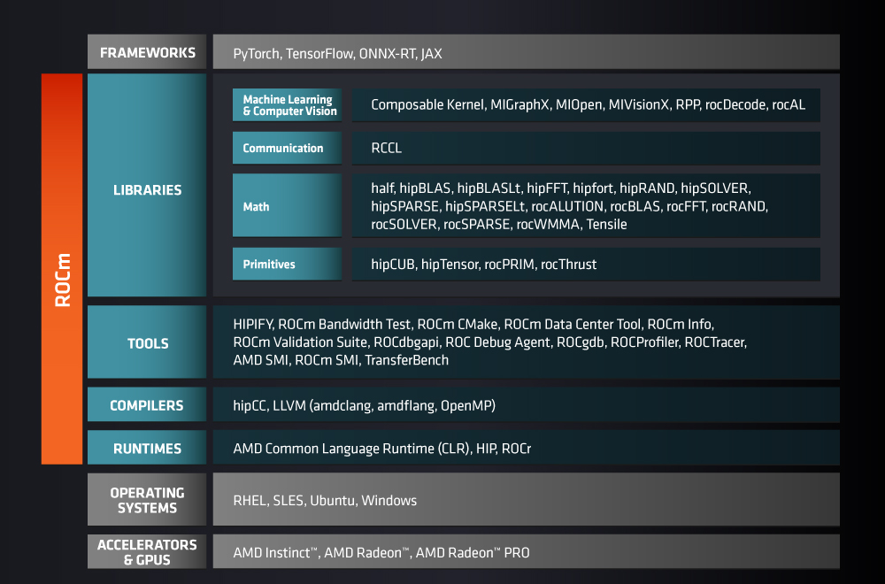

.. meta::
  :description: What is ROCm
  :keywords: ROCm components, ROCm projects, introduction, ROCm, AMD, runtimes, compilers, tools, libraries, API

***********************************************************
What is ROCm?
***********************************************************

ROCm is an open-source stack, composed primarily of open-source software, designed for
graphics processing unit (GPU) computation. ROCm consists of a collection of drivers, development
tools, and APIs that enable GPU programming from low-level kernel to end-user applications.

ROCm is powered by
`Heterogeneous-computing Interface for Portability (HIP) <https://rocm.docs.amd.com/projects/HIP/en/latest/index.html>`_;
it supports programming models, such as OpenMP and OpenCL, and includes all necessary open
source software compilers, debuggers, and libraries. It's fully integrated into machine learning (ML)
frameworks, such as PyTorch and TensorFlow.

.. tip::
  If you're using Radeon GPUs, refer to the
  :doc:`Radeon-specific ROCm documentation <radeon:index>`.

ROCm components
===============================================

ROCm consists of the following components. For information on the license associated with each component,
see :doc:`ROCm licensing <./about/license>`.

Libraries
-----------------------------------------------

Machine Learning & Computer Vision
^^^^^^^^^^^^^^^^^^^^^^^^^^^^^^^^^^^^^^^^^^^^^^^

.. csv-table::
  :header: "Component", "Description"

  ":doc:`Composable Kernel <composable_kernel:index>`", "Provides a programming model for writing performance critical kernels for machine learning workloads across multiple architectures"
  ":doc:`MIGraphX <amdmigraphx:index>`", "Graph inference engine that accelerates machine learning model inference"
  ":doc:`MIOpen <miopen:index>`", "An open source deep-learning library"
  ":doc:`MIVisionX <mivisionx:doxygen/html/index>`", "Set of comprehensive computer vision and machine learning libraries, utilities, and applications"
  ":doc:`rocAL <rocal:index>`", "An augmentation library designed to decode and process images and videos"
  ":doc:`rocDecode <rocdecode:index>`", "High-performance SDK for access to video decoding features on AMD GPUs"
  ":doc:`ROCm Performance Primitives (RPP) <rpp:index>`", "Comprehensive high-performance computer vision library for AMD processors with HIP/OpenCL/CPU back-ends"

Communication
^^^^^^^^^^^^^^^^^^^^^^^^^^^^^^^^^^^^^^^^^^^^^^^

.. csv-table::
  :header: "Component", "Description"

  ":doc:`RCCL <rccl:index>`", "Standalone library that provides multi-GPU and multi-node collective communication primitives"

Math
^^^^^^^^^^^^^^^^^^^^^^^^^^^^^^^^^^^^^^^^^^^^^^^

.. csv-table::
  :header: "Component", "Description"

  "`half <https://github.com/ROCm/half/>`_", "C++ header-only library that provides an IEEE 754 conformant, 16-bit half-precision floating-point type, along with corresponding arithmetic operators, type conversions, and common mathematical functions"
  ":doc:`hipBLAS <hipblas:index>`", "BLAS-marshaling library that supports `rocBLAS <https://rocm.docs.amd.com/projects/rocBLAS/en/latest/>`_ and cuBLAS backends"
  ":doc:`hipBLASLt <hipblaslt:index>`", "Provides general matrix-matrix operations with a flexible API and extends functionalities beyond traditional BLAS library"
  ":doc:`hipFFT <hipfft:index>`", "Fast Fourier transforms (FFT)-marshalling library that supports rocFFT or cuFFT backends"
  ":doc:`hipfort <hipfort:index>`", "Fortran interface library for accessing GPU Kernels"
  ":doc:`hipRAND <hiprand:index>`", "Ports CUDA applications that use the cuRAND library into the HIP layer"
  ":doc:`hipSOLVER <hipsolver:index>`", "An LAPACK-marshalling library that supports `rocSOLVER <https://rocm.docs.amd.com/projects/rocSOLVER/en/latest/>`_ and cuSOLVER backends"
  ":doc:`hipSPARSE <hipsparse:index>`", "SPARSE-marshalling library that supports `rocSPARSE <https://rocm.docs.amd.com/projects/rocSPARSE/en/latest/>`_ and cuSPARSE backends"
  ":doc:`hipSPARSELt <hipsparselt:index>`", "SPARSE-marshalling library with multiple supported backends"
  ":doc:`rocALUTION <rocalution:index>`", "Sparse linear algebra library for exploring fine-grained parallelism on ROCm runtime and toolchains"
  ":doc:`rocBLAS <rocblas:index>`", "BLAS implementation (in the HIP programming language) on the ROCm runtime and toolchains"
  ":doc:`rocFFT <rocfft:index>`", "Software library for computing fast Fourier transforms (FFTs) written in HIP"
  ":doc:`rocRAND <rocrand:index>`", "Provides functions that generate pseudorandom and quasirandom numbers"
  ":doc:`rocSOLVER <rocsolver:index>`", "An implementation of LAPACK routines on ROCm software, implemented in the HIP programming language and optimized for AMD's latest discrete GPUs"
  ":doc:`rocSPARSE <rocsparse:index>`", "Exposes a common interface that provides BLAS for sparse computation implemented on ROCm runtime and toolchains (in the HIP programming language)"
  ":doc:`rocWMMA <rocwmma:index>`", "C++ library for accelerating mixed-precision matrix multiply-accumulate (MMA) operations"
  "`Tensile <https://github.com/ROCm/Tensile>`_ ", "Creates benchmark-driven backend libraries for GEMMs, GEMM-like problems, and general N-dimensional tensor contractions"

Primitives
^^^^^^^^^^^^^^^^^^^^^^^^^^^^^^^^^^^^^^^^^^^^^^^

.. csv-table::
  :header: "Component", "Description"

  ":doc:`hipCUB <hipcub:index>`", "Thin header-only wrapper library on top of `rocPRIM <https://rocm.docs.amd.com/projects/rocPRIM/en/latest/>`_ or CUB that allows project porting using the CUB library to the HIP layer"
  ":doc:`hipTensor <hiptensor:index>`", "AMD's C++ library for accelerating tensor primitives based on the composable kernel library"
  ":doc:`rocPRIM <rocprim:index>`", "Header-only library for HIP parallel primitives"
  ":doc:`rocThrust <rocthrust:index>`", "Parallel algorithm library"

Tools
-----------------------------------------------

.. csv-table::
  :header: "Component", "Description"

  ":doc:`AMD SMI <amdsmi:index>`", "C library for Linux that provides a user space interface for applications to monitor and control AMD devices"
  ":doc:`HIPIFY <hipify:index>`", "Translates CUDA source code into portable HIP C++"
  "`Radeon Compute Profiler (RCP) <https://github.com/GPUOpen-Tools/radeon_compute_profiler/>`_ ", "Performance analysis tool that gathers data from the API runtime and GPU for OpenCL and ROCm/HSA applications"
  "`RocBandwidthTest <https://github.com/ROCm/rocm_bandwidth_test/>`_ ", "Captures the performance characteristics of buffer copying and kernel read/write operations"
  ":doc:`ROCmCC <./reference/rocmcc>`", "Clang/LLVM-based compiler"
  "`ROCm CMake <https://github.com/ROCm/rocm-cmake>`_ ", "Collection of CMake modules for common build and development tasks"
  ":doc:`ROCm Data Center Tool <rdc:index>`", "Simplifies administration and addresses key infrastructure challenges in AMD GPUs in cluster and data-center environments"
  "`ROCm Debug Agent (ROCdebug-agent) <https://github.com/ROCm/rocr_debug_agent/>`_ ", "Prints the state of all AMD GPU wavefronts that caused a queue error by sending a SIGQUIT signal to the process while the program is running"
  ":doc:`ROCm Debugger (ROCgdb) <rocgdb:index>`", "Source-level debugger for Linux, based on the GNU Debugger (GDB)"
  ":doc:`ROCdbgapi <rocdbgapi:index>`", "ROCm debugger API library"
  "`rocminfo <https://github.com/ROCm/rocminfo/>`_ ", "Reports system information"
  ":doc:`ROCm SMI <rocm_smi_lib:index>`", "C library for Linux that provides a user space interface for applications to monitor and control GPU applications"
  ":doc:`ROCm Validation Suite <rocmvalidationsuite:index>`", "Detects and troubleshoots common problems affecting AMD GPUs running in a high-performance computing environment"
  ":doc:`ROCProfiler <rocprofiler:profiler_home_page>`", "Profiling tool for HIP applications"
  ":doc:`ROCTracer <roctracer:index>`", "Intercepts runtime API calls and traces asynchronous activity"
  ":doc:`TransferBench <transferbench:index>`", "Utility to benchmark simultaneous transfers between user-specified devices (CPUs/GPUs)"

Compilers
-----------------------------------------------

.. csv-table::
  :header: "Component", "Description"

  "`AOMP <https://github.com/ROCm/aomp/>`_", "Scripted build of `LLVM <https://github.com/ROCm/llvm-project>`_ and supporting software"
  "`FLANG <https://github.com/ROCm/flang/>`_", "An out-of-tree Fortran compiler targeting LLVM"
  "`hipCC <https://github.com/ROCm/HIPCC>`_ ", "Compiler driver utility that calls Clang or NVCC and passes the appropriate include and library options for the target compiler and HIP infrastructure"
  "`LLVM (amdclang) <https://github.com/ROCm/llvm-project>`_ ", "Toolkit for the construction of highly optimized compilers, optimizers, and runtime environments"

Runtimes
-----------------------------------------------

.. csv-table::
  :header: "Component", "Description"

  "`AMD Common Language Runtime (CLR) <https://github.com/ROCm/clr>`_", "Contains source code for AMD's common language runtimes: :doc:`HIP <hip:index>` and OpenCL"
  ":doc:`HIP <hip:index>`", "AMD's GPU programming language extension and the GPU runtime"
  "`ROCR-Runtime <https://github.com/ROCm/ROCR-Runtime/>`_ ", "User-mode API interfaces and libraries necessary for host applications to launch compute kernels on available HSA ROCm kernel agents"
